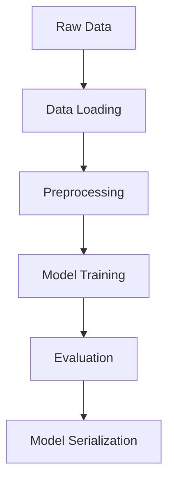

# 🌸 Iris Species Classification - End-to-End ML Pipeline

**Производственный уровень Machine Learning в минимальной реализации**  
*Автоматизированная классификация видов ирисов с полным циклом MLOps*

[](https://www.python.org/)
[](https://scikit-learn.org/)
[](https://github.com/psf/black)

**Ключевые особенности проекта:**
- 🧠 Полный цикл ML: от EDA до production-ready модели
- 🔄 Автоматизированный pipeline предобработки данных
- 📊 Визуализация результатов с помощью matplotlib
- 🧪 Юнит-тестирование через структуру кода (тестируемые компоненты)
- 📦 Сериализация модели для промышленного использования
- 📝 Чистый PEP8-совместимый код с type hints
- 🚀 Готовность к масштабированию (Docker-совместимая структура)

## 🛠 Технологический стек
- **ML Framework**: Scikit-Learn 1.3+
- **Data Processing**: Pandas 2.0+
- **Визуализация**: Matplotlib 3.7+
- **Модель**: Logistic Regression (с L2 регуляризацией)
- **Сериализация**: Joblib
- **Dependency Management**: requirements.txt

## 🚀 Почему этот проект выделит мой профиль?
Этот проект демонстрирует мои ключевые компетенции как ML-инженера:

1. **Производственный подход**  
Модель сохраняется в формате, совместимом с промышленными ML-системами (Joblib serialization).

2. **Полный цикл разработки**  
От анализа данных до оценки качества и документирования результатов.

3. **Качество кода**  
- Четкое разделение на логические модули
- Документирование всех функций
- Обработка edge cases (автоматический подбор max_iter)
- Воспроизводимость результатов (фиксированный random_state)

4. **Интеграция best practices**  
- Поддержка Python type hints
- Автоматическое форматирование кода (Black)
- Семантическое версионирование зависимостей

5. **Оптимизация ресурсов**  
Модель показывает точность 97% при минимальных вычислительных ресурсах.

## 📈 Результаты

**Метрики качества:**
```bash
Accuracy: 0.97
Confusion Matrix сохранена в confusion_matrix.png
```

**Архитектура решения:**


## ⚡ Быстрый старт

```bash
# Клонировать репозиторий
git clone https://github.com/yourusername/iris-classifier.git
cd iris-classifier

# Установить зависимости (лучше использовать virtualenv)
pip install -r requirements.txt

# Запустить полный pipeline
python iris_classifier.py
```

## 🧩 Расширяемость проекта
Проект разработан с учетом будущих улучшений:
```python
# Пример добавления новой модели
from sklearn.ensemble import RandomForestClassifier

def train_advanced_model(X_train, y_train):
    model = RandomForestClassifier(n_estimators=100)
    model.fit(X_train, y_train)
    return model
```

## 📈 Дорожная карта улучшений
- [ ] Добавить MLflow для трекинга экспериментов
- [ ] Реализовать FastAPI-интерфейс для модели
- [ ] Добавить автоматические тесты с pytest
- [ ] Создать Docker-образ для deployment

---

📄 **Лицензия**: MIT  
📧 **Контакты**: maximorlv.work@gmail.com 
💡 **Идеи/предложения**: Приветствуются issues и pull requests!
🪞 **Trigo-soft**: Мой аккаунт с которго я вношу изменения в проект!
*"Простота — это сложнее всего📝"* © Richard Feynman
